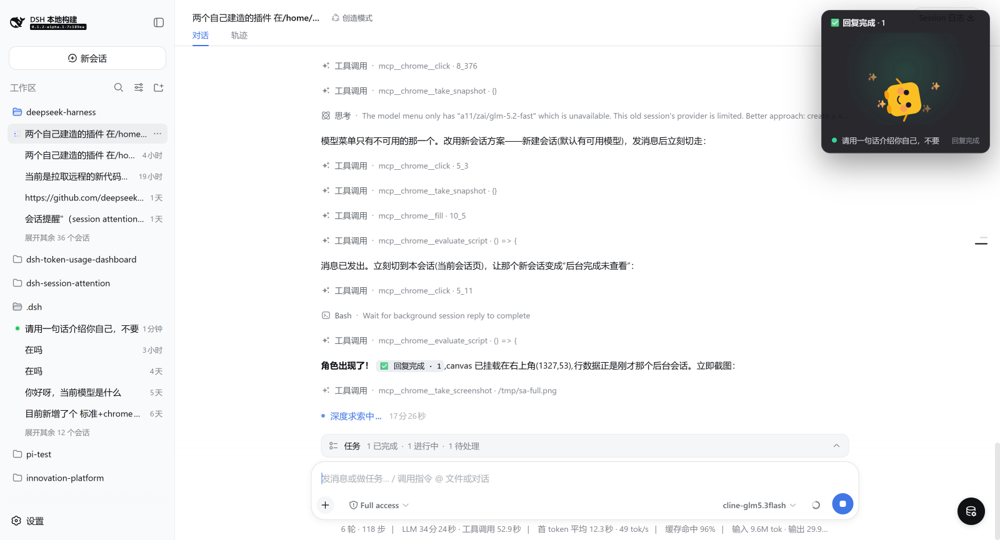

# dsh-session-attention

[English](README.en.md) | 中文

[DeepSeek Harness](https://github.com/deepseek-ai/deepseek-harness) 的会话消息通知覆盖层插件。

一个角色从 Web GUI 的右上角探出，在任意会话等待用户操作（审批 / 计划待审 / 提问）或后台会话的 AI 回复完成未查看时，播放与提醒类型对应的舞蹈动画。所有会话处理完毕后角色缩回。



## 架构

两个包组成完整功能：

| 包 | 名称 | 角色 |
|---|---|---|
| `client/` | `@deepseek-ai/dsh-client-ui-session-attention` | 纯浏览器插件：一个 `shell.overlay` 入口，监听会话列表并渲染 Canvas2D 角色动画 |
| `bundle/` | `@deepseek-ai/dsh-session-attention` | Profile bundle：一个 `cordis.patch.yml` 插入客户端面板行 |

该插件是**纯客户端**的——没有 host 半插件、没有 Service Definition、没有事件。它读取 web 界面已提供的标准 `useSessions` 和 `useSessionPendingInteraction` 数据流。

### 数据流

```
会话状态 → useSessions hook（完成提醒）
           useSessionPendingInteraction hook（审批/计划待审/提问）
                               ↓
               selectAttention(list, pending) — 纯派生
                               ↓
               AttentionPanel（shell.overlay 入口）
               ├── 角色动画（Canvas2D）
               ├── 关注行（点击打开会话）
               └── 浏览器标签页标题前缀 (N)
```

### 角色动画

角色生命周期是四阶段状态机：`peek → enter → dance → exit → peek`。四种舞蹈对应四种提醒类型：

- **approval（审批）** — 焦急的小跳加身体抖动
- **plan-review（计划待审）** — 思考的摇摆加歪头，思考窗口期间头顶出现 ✨
- **question（提问）** — 困惑的左右歪头加 `?` 气泡
- **completed（完成）** — 庆祝的弹跳、摇摆、旋转加 ✨

动画引擎从流逝时间和生命周期阶段纯函数地计算每帧的 `translate / rotate / scale / squash` 变换——确定性（无 `Math.random`）且可在 jsdom 中完整测试。角色可以是用户提供的 PNG（通过 `characterImage` 配置）或程序绘制的默认角色。

## 安装

```sh
dsh plugin --profile <name> add @deepseek-ai/dsh-session-attention
```

面板仅在 web 界面中渲染，因此目标 profile 必须已提供 client 运行时、连接和 `shell.overlay` 布局。需要 `pnpm` 在 `PATH` 上。

### 自定义角色图片

```yaml
- id: ui-session-attention
  name: '@deepseek-ai/dsh-client-ui-session-attention'
  config:
    characterImage: 'data:image/png;base64,...'
```

不设置时使用程序绘制的默认角色。

## 用法

覆盖层无需配置：在下次启动时开始运行，监听标准会话数据流。角色从右上角探出，在需要关注时跳出舞蹈，并显示等待操作的会话行。点击一行可打开该会话并消除提醒。有待办时浏览器标签页标题加 `(N)` 前缀，使提醒在标签页切到后台时仍可见。

## 源码布局

```
dsh-session-attention/
├── client/
│   ├── src/
│   │   ├── index.ts               # Host 加载入口（空 apply）
│   │   ├── invariant.ts           # 包不变量伴随
│   │   ├── css-modules.d.ts       # CSS Modules 类型声明
│   │   └── client/
│   │       ├── index.ts           # 浏览器插件：shell.overlay 注册
│   │       ├── attention.ts       # 纯关注行选择逻辑
│   │       ├── AttentionPanel.tsx # 面板组件（行 + 画布）
│   │       ├── character.ts       # Canvas2D 动画引擎（624 行）
│   │       ├── character-lifecycle.ts  # peek→enter→dance→exit 状态机
│   │       ├── contract/
│   │       │   └── slots.ts       # Inject face 契约
│   │       └── ...
│   └── package.json
├── bundle/
│   ├── cordis.patch.yml           # 1 行插入：客户端面板
│   ├── src/
│   │   ├── index.ts               # 空壳 carrier
│   │   └── invariant.ts           # Bundle 不变量伴随
│   └── package.json
└── package.json                   # 根 workspace
```

## 依赖

该插件依赖以下 DSH 包（从 DSH monorepo 安装）：

- `@deepseek-ai/cordis` — Cordis 插件框架
- `@deepseek-ai/dsh-client-ui-layout` — `shell.overlay` slot 声明者
- `@deepseek-ai/dsh-client-ui-renderer` — Slot registry 服务
- `@deepseek-ai/dsh-client-ui-session` — `useSessions` 和 `useSessionPendingInteraction` hook
- `@deepseek-ai/dsh-api-session-controller` — `SessionListState`、`SessionSummary`、`PendingInteractionStatus`
- `@deepseek-ai/dsh-session` — `SessionId` 品牌类型

## 许可证

MIT
